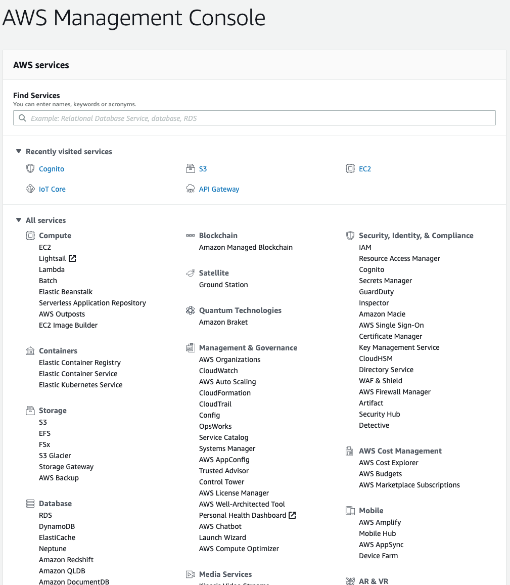
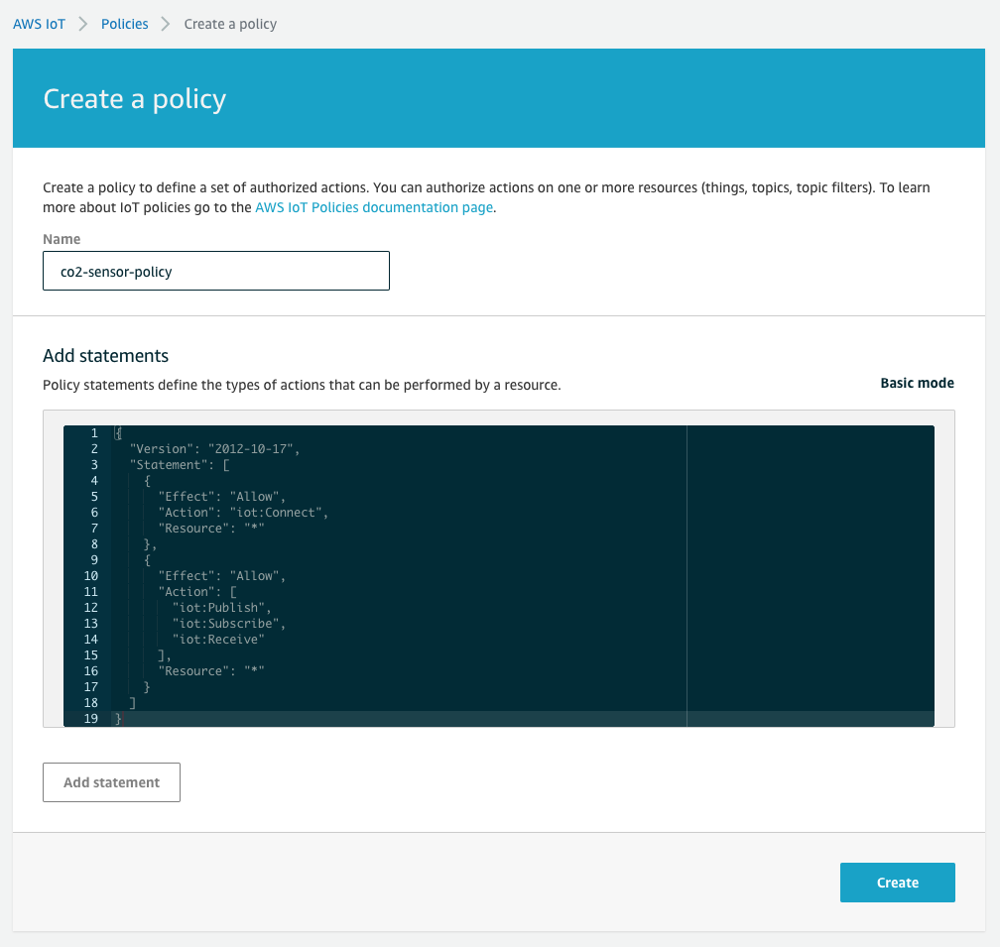
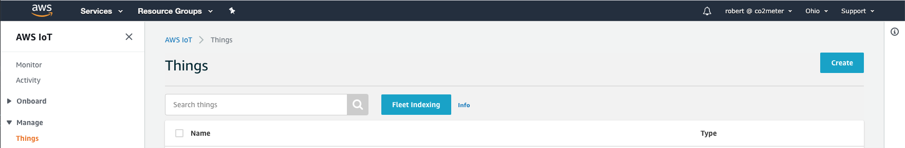
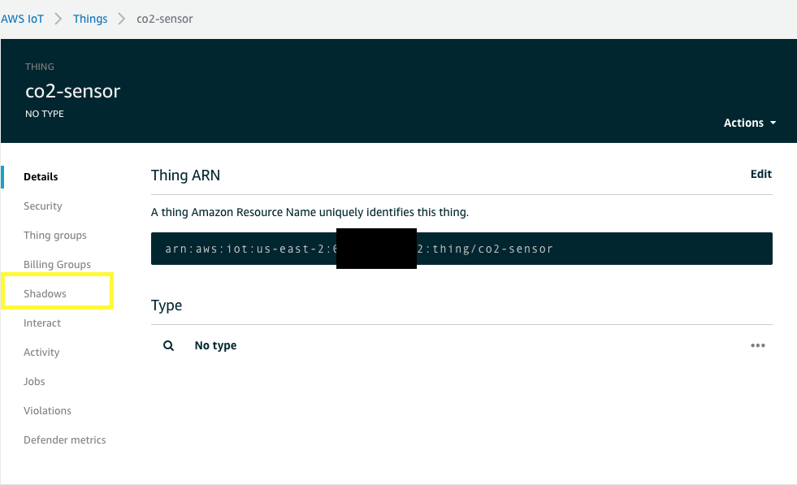

# CO2Meter IoT Development Kit

## Table of Contents
1. [Getting to Know Your DevKit](#getting-to-know-your-devkit)
2. [General Setup](#general-setup)
  - [Arduino](#arduino)
  - [iOS](#ios)
  - [Android](#android)
3. [Bluetooth](#bluetooth)
4. [WiFi](#wifi)
5. [AWS IoT](#aws-iot)
6. [Troubleshooting](#troubleshooting)

## Getting to Know Your DevKit

> The CO2Meter IoT DevKit is a hardware development board with a built-in WiFi / Bluetooth microcontroller, a voltage regulator and external LiPol battery, battery recharge circuit, and two sets of headers for the ESP32 GPIO Header, or an external sensor header.

#### ESP32-WROOM
The CO2Meter IoT DevKit comes with a standard ESP32-WROOM with dual-core processor, on-board WiFi and Bluetooth with a built-in antenna.  ESP32 can programmed using [ESP-IDF](https://github.com/espressif/esp-idf), or using the [Arduino Library](https://github.com/espressif/arduino-esp32).

#### Boot Mode Switch
The boot mode switch allows you to put the ESP32 into normal mode to run your latest program, or boot mode to load your program onto the onboard flash.  The boot mode switch also gives you the flexibility to choose how to connect to your sensor, by either connecting directly to the ESP32 Hardware UART or connecting an external microcontroller to the Sensor External Header.

| Mode | 1 | 2 | 4 | 8 | Switch Position |
| :---: | :---: | :---: | :---: | :---: | :---: |
| Load | 1 | X | X | 0 | 1,3,5,7 |
| Normal | 0 | 0 | 0 | 0 | 0 |
| MCU | X | 1 | 1 | 1 | E,F |
| ESP Comm / MCU Alt | 0 | 0 | 1 | 0 | 4 |
| MCU Comm / ESP Alt | 0 | 1 | 0 | 0 | 2 |

1. Load puts the ESP32 into Serial Bootloader mode for programming from Arduino IDE or other ESP Loader
2. Normal Mode is the normal operation of the ESP having full communication with the S11 / LP
3. MCU Mode has the ESP Disabled, and power and comms are provided by the External 10-pin MCU Connector
4. ESP Comm / MCU Alt mode allows the RX / TX Communications to come from the ESP and the EN / nRDY / COMSEL to come from the External MCU Connector
5. MCU Comm / ESP Alt will allow the RX / TX Communications to come from the External MCU Connector and the ESP can control the EN / nRDY / COMSEL

#### GPIO Header
You have several unused GPIOs available that are labeled, making it easier to know which GPIO you're connected and which to reference in your application.  Also available is the hardware I2C pins.  There are unpopulated resistor pads to add I2C Pullup Resistors if your external I2C device does not contain them.

#### USB to UART Connector
Made available is the Hardware UART0 pins on the USB connector, allowing you to view your print statements, or giveing you the ability to communicate in a terminal program with your sensor over UART.  The USB connector can also provide the power to recharge the external 3.7V LiPol battery.  There is an amber LED to let you know when the battery is fully charged.

#### Battery Connector
A standard JST connector for external LiPol battery.  In order to work correctly with the battery recharge circuit, this must be a 3.7V Lithium Polymer Battery.  We have provided a 400mAh battery with your kit, but there are several others available on Amazon, Digikey, Mouser, etc. with capacities of up to 10,000mAh, giving you more battery to power your development kit for even longer.

#### Sensor External Header
If you have an external microcontroller that you want to use to communicate with the CO2 sensor, those pins are available and clearly labeled.  It is required that you change the Boot Mode Switch in order to use your external microcontroller.

#### GPIO Push Button
You have available a standard push button that is connected to the ESP32 GPIO Pin 35.  This allows you to program your ESP32 to wakeup, even from a Deep Sleep, by actuating the push button.  You can also use this button while the program is running to trigger any other events.

#### Sensor Connectors
Connectors for the 9-pin S11 Connector and the 12-pin Cozir LP Blink CO2 Sensors.

## General Setup
#### Arduino
To quickly start programming your CO2Meter IoT DevKit, we have provided 3 different Arduino programs for each of the sensors available, the Senseair S11 and CozIR LP2 Blink.  To get started, you will need to download the [Arduino IDE](https://www.arduino.cc/en/main/software), then run and install the IDE, if you haven't already.  

You then need to install the ESP32 boards in the Board Manager:
> If you have a Windows PC, continue, if you have MacOS you can [skip to the Mac Section here](#mac)
#### Windows:
Click File->Preferences


Then enter the url:
```
https://dl.espressif.com/dl/package_esp32_index.json
```
into Additional Boards Manager URLs Text Box


After Clicking the OK button, go to the Boards Manager


Search for the ESP32 and click on the Install button


Once you finished the installation, you will see a new set of boards available to select.  Select the ESP32 Dev Module


You can now skip to the [Libraries Section Here](#libraries)

#### Mac:
Click Arduino->Preferences


Then enter the url:
```
https://dl.espressif.com/dl/package_esp32_index.json
```
into the Additional Boards Manager URLs Text Box


After Clicking the OK button, go to the Boards Manager and search for esp32 and install


Search for ESP32 and click on the Install button


Once you finished the installation, you will see a new set of boards available to select.  Select the ESP32 Dev Module


#### Libraries:
There are multiple libraries that are required to compile and run the Arduino applications.  Some of which are downloaded, and others can be installed from the Libraries Manager.

##### MQTT:
The Arduino project requires an MQTT library that can be installed directly through Arduino IDE.  Go to the Manage Libraries in Sketch->Include Library->Manage Libraries


In the search bar, type
```
mqtt
```
Find the MQTT library, and install


##### Adafruit-BME280
To be able to read the BME280 sensor on the DevKit (for Temperature, Pressure, and Relative Humdity), the Adafruit BME280 Library must be installed.

While still in the Manage Libraries windows

Search for, and install the Adafruit BME280 Library


##### Adafruit Unified Sensor
The Adafruit BME280 has a dependency with the Adafruit Unified Sensor library, so that library also needs to be installed.

While sitll in the Manage Libraries window, search for, and install the Adafruit Unified Sensor Library


##### Adafruit BusIO
The Adafruit Unified Sensor has a dependency with the Adafruit BusIO library, so that library also needs to be installed.

While sitll in the Manage Libraries window, search for, and install the Adafruit BusIO Library


##### ESPAsyncWebServer:
Multiple Arduino sketches use the ESPAsyncWebServer library to act as a local web server.  To install this library into your Arduino IDE, go the [ESPAsyncWebServer GitHub Repository](https://github.com/me-no-dev/ESPAsyncWebServer) and download the project by clicking on the Green "Code" button, then click the "Download Zip" button and save it as a zip file.


When the download is completed, add the zip library into Arduino IDE by going to Sketch->Include Library->Add .ZIP Library


Navigate to your downloads folder, locate the zip file named "ESPAsyncWebServer-master.zip" and Click "Choose"

##### AsyncTCP
ESPAsyncWebServer has a dependency that also needs to be installed [AsyncTCP](https://github.com/me-no-dev/AsyncTCP).

To install this library into your Arduino IDE, go the [AsyncTCP](https://github.com/me-no-dev/AsyncTCP) and download the project zip file.


When the download is completed, add the zip library into Arduino IDE by going to Sketch->Include Library->Add .ZIP Library


Navigate to your downloads folder, locate the zip file named "AsyncTCP-master.zip" and Click "Choose"

##### Arduino General Setup Done
Congrats! Setup for the Arduino environment is now down, and it's time to start making!  [Go back to the top](#table-of-contents) to find the next section you want to follow.

#### iOS
> To Test on iOS, it is required to have a hardware device such as an iPhone or iPad.  Not all features will function using the XCode Simulator.  XCode is only available for MacOS.  To ensure best results, update to the latest version of MacOS and XCode.

Download [XCode](https://apps.apple.com/us/app/xcode/id497799835?mt=12) from the MacOS App Store and install.  Startup XCode to make sure everything is installed and running correctly.

The demo applications use [Cocoapods](https://cocoapods.org/about) to add and maintain external frameworks.  To install Cocoapods, open the Terminal Application from your Applications folder, or on your keyboard, typing Command+Spacebar, then typing Terminal in the search bar. 

In your terminal, type in the command:

`sudo gem install cocoapods`

When cocoapods completes the installation, change directory to the project folder.  For our example, the project was downloaded to the users Documents->Projects->co2meter-iot-devkit->Mobile Apps->ios->IoT DevKit.  So the command will be:

`cd ~/Documents/Projects/co2meter-iot-devkit/Mobile\ Apps/ios/IoT\ DevKit/`

Once you are in the correct directory, type the command:

`pod install`

When the command completes and the frameworks are installed, open the **IoT DevKit.xcworkspace**.  It's very important to open workspace and not the project, as this could corrupt the frameworks.

With the workspace open, connect your device, and click on Build and Run to install and debug the application on your device.

#### Android
To test on Android devices, download and install [Android Studio](https://developer.android.com/studio).  When installation is complete, open the project from Finder, Windows Explorer, or open the project within Android Studio.  Connect your device, and Build and Run.
> If the build or gradle sync fails, change to Build Online mode

## How to Load Your Arduino Program
To load an Arduino Sketch, you first need to power the ESP32 into Serial Boot Mode.  To do this, change the Boot Switch to 1 and push then release the Reset Momentary Switch.

Next, select the port in Arduino that the ESP32 DevKit is connected.


Click on the build and load button


Finally, to run the Arduino sketch, move the Boot Mode switch back to 0 and press the Reset Button.

## Bluetooth
Running the Bluetooth application requires additional setup.  Just run the provided Mobile Application, and follow the [Arduino steps](#how-to-load-your-arduino-program) to load the co2meter_demo_ble Arduino Sketch.

## WiFi
To run the WiFi application, you need to update your WiFi SSID and Password in the Arduino Sketch.  


Once that is done, load the WiFi sketch using the [Arduino steps to load your Arduino Program](#how-to-load-your-arduino-program)

### WiFi Plotter
Included is a python application that will connect to the WiFi server, and to log data to a file and plot the data along the way.  Additionally, the python application can plot a data log that already exists, or retrieve and plot a log file from the data logger application with WiFi server wakeup.

The application requires python3 and pip3 to install the requests and matplotlib modules.

Make sure you have python3 by opening a terminal application or Windows Power Shell Command Prompt, and typing:
```
python --version
```
or
```
python3 --version
```

If you do not have python3, you will need to install it by following the links below:
[Windows](https://www.python.org/downloads/windows/)
[MacOS](https://www.python.org/downloads/mac-osx/)
> Raspberry Pi and Linux _should_ already have Python pre-installed.  If not, consider re-installing your distro

To check if you have pip, use the command:
```
pip --version
```
or
```
pip3 --version
```
>Make sure that the version of pip installed matches the version of python installed

To install pip, follow the official instructions from the distro:
[Pip Install](https://pip.pypa.io/en/stable/installing/)

After checking or installing python and pip, install the modules that are required:
```
pip install requests
```
```
pip install matplotlib
```
or if you have pip3
```
pip3 install requests
```
```
pip3 install matplotlib
```

The application is now ready to run by calling:
```
python wifiplot.py -d logfile.csv -t 5
```


## AWS IoT
To demo the AWS IoT application, it's required to do some more setup.  Fist step is to follow the same steps as the [WiFi Application](#wifi) and update your WiFi credentials.  Follow the next steps or skip ahead as needed:
1. [Create AWS Account](#create-aws-account)
2. [Setup AWS IoT](#setup-aws-iot)
3. [Download Arduino Library](#download-arduino-library)
4. [Update Library Certificates](#update-library-certificates)
5. [Update Sketch](#update-sketch)
6. [Test](#test)
7. [Troubleshooting](#troubleshooting)

### Create AWS Account
If you don't already have an AWS Account, it's free to [create and own](https://aws.amazon.com/resources/create-account/).  You only pay for the services you use.  Amazon gives you a free tier for your first year.  The AWS IoT application provided has no cost associated with the free tier account.  If you have an account already, [sign in](https://aws.amazon.com/console/).

> Note: If you are just now creating an AWS Account, it can take up to 24 hours until AWS IoT Core is available for use.

### Setup AWS IoT
#### AWS IoT Service
After logging in to your AWS Console, search for the IoT Core service and click.




#### iOS Cognito
If you plan on using the included iOS Demo application, it is required to create an AWS Cognito Identity Pool.
> These steps only need to be followed if you plan to use the iOS Demo Application.  If you are only using Android, or Web Based, ignore this section

From the AWS Console, search for services and type "cognito" in the searchbar.


In the Cognito Main Dashboard, select "Manage Identity Pools"


In the new Identity Pool Wizard, create a unique name for the Identity Pool, and select the Enable access to unauthenticated identities checkbox.


Leave the prefilled options to Create a new IAM Role, and click on the "Allow" button.  Make a note of the Role name for the unauthenticated role, though they both should be very similar and based on the name of the Cognito Identity pool from the previous page.


After clicking allow, make a note of the identity pool id and region.


Next, head over to the AWS IAM Service.


From the IAM Dashboard, click on Roles


Find the role that you just created and click to view the options.  In the Role Summary, click on Attach Policies


In the search bar to filter policies, type:
```
AWSIoTFullAccess
```
and select the policy that shows up, and click "Attach Policy"


You're now all set to use iOS with AWS IoT Core

#### Create Policy
First thing we need to do in the AWS IoT Core is create a security policy.  This will be attached to your IoT Thing certificates and allows your device to communicate on the MQTT Channels and update your Thing Shadow.


From the Policies main page, we will create a new policy


In the Create Policy Wizard, click on the "Advanced" button


Remove the current text, then copy and paste the following into the text box:
```json
{
  "Version": "2012-10-17",
  "Statement": [
    {
      "Effect": "Allow",
      "Action": "iot:Connect",
      "Resource": "*"
    },
    {
      "Effect": "Allow",
      "Action": [
        "iot:Publish",
        "iot:Subscribe",
        "iot:Receive"
      ],
      "Resource": "*"
    }
  ]
}
```



Click create to complete the security policy

#### Create and Register Thing
Next step is create and register our DevKit as an AWS IoT Thing.  Go to the Manage->Things in the IoT Core Sidebar


From the Things Home Page, click the Create button



For our purposes, we will create a Single Thing


Fill out the Thing Registration Form


Next, follow Amazon's recommendation and do a One-Click certificate creation


Next activate and download the newly created certificates.  You will also need to download the Amazon Root Certificate.  You can follow the links provided on the page, or you can go [here](https://www.amazontrust.com/repository/AmazonRootCA1.pem).

Next, attach the policy and Register Thing


Now your Thing is created!

#### Update Library Certificates
Included in the project folder, is a file named certs.h.

Copy and paste in your certificate and add \n\ at the end of each line similar to the image:


### Update Sketch
In the AWS IoT Settings, write down the IoT endpoint:


Using these details, update the corresponding aws_iot Arduino Sketch


We have left open, the possibility of using a different topic if IoT rules were required.  We will not get into this specifically just yet, and you can leave the RULE_TOPIC_NAME as it is.

### Test
Everything should now be setup and ready to go for testing.  [Load your Arduino Sketch](#how-to-load-your-arduino-program) using the co2meter_aws_iot_test or co2meter_blink_aws_iot_test.  Follow the Serial Output in the Arduino IDE to see when CO2 data has been uploaded.  To check that everything worked, you can go to your Thing Shadow and check the output.


### Troubleshooting
#### Arduino Sketch Has Errors
If the Arduino sketch will not compile and load, make sure you are following the [Arduino Setup](#arduino) and that you selected an ESP32 board.

#### Arduino Sketch Will Not Load
Ensure that you have the correct COM port selected, that your PC / Mac is up to date and has the latest [FTDI drivers](https://www.ftdichip.com/FTDrivers.htm) installed.  If the Arduino Sketch still will not load, ensure that the DevKit is in Serial Boot Mode.  Follow the [above instructions](#how-to-load-your-arduino-program).  If you have your Serial Monitor open in the Arduino IDE, you will see a message indicating that it is ready for Serial Boot Loading.


#### Shadow Will Not Update
##### Check Custom Endpoint
Follow the [AWS IoT Update Sketch](#update-sketch) and make sure that the custom endpoint is correct.

##### Check the Certificates
Follow the [Update Library Certificates](#update-library-certificates) and make sure that you have the correct corresponding certificates copied into the Hornbill Library

##### Check the Thing Name
In the [Update Sketch](#update-sketch) section, ensure that the correct Thing name is being used for the CLIEN_ID and TOPIC_NAME:
`$aws/things/your-thing-name/shadow/update`

In the example, we have used co2-sensor for the Thing name, and this may be different for you depending on the name used in [Create and Register Thing](#create-and-register-thing).

##### Check the Policy
Make sure that the [Create Policy](#create-policy) was followed correctly and that the policy was attached to the certificates.  You can check that the policy is attached by going to the policy and seeing attached certs.


If the policy has no attached certificates, you can attach the poilcy by going to Manage -> Things


Go to the Security tab of the Thing, then click on the certificates available, and finally, add the policy.  To do this, click on the Policies Tab, then click on the Actions button and Attach Policy.  Finally, click on the policy you want to attach.


##### Still No Go?
Test your MQTT connection in AWS IoT.


Test with any topic by first subscribing to a topic.


Then publish to that topic


And finally, check that the message has been received


If the message is successfully received, now test the shadow updates.  Open a second tab or window, and go to the AWS IoT Core to view your Thing shadow





Now publish to the Update Shadow topic: `$aws/things/co2-sensor/shadow/update` and copy this JSON message:
```json
{
  "state" : {
    "reported": {
      "co2": " 1200 ",
      "temperature": " 23.240000 ",
      "humidity": " 59.658203 ",
      "pressure": " 101375.515625 ",
      "name": " co2-sensor ",
      "timestamp": " 1597754438 ",
      "ttl": 1598186438
    }
  }
}
```


If issues still arise, delete the Thing and start over in the [AWS IoT](#aws-iot) section.
